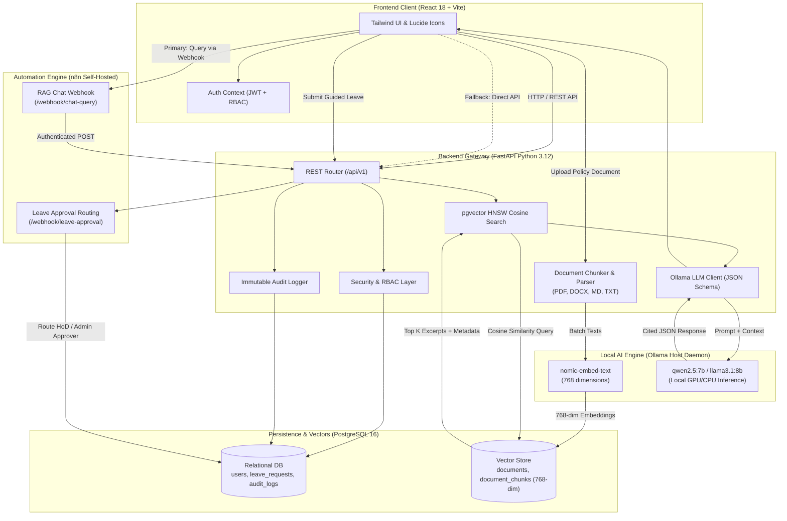
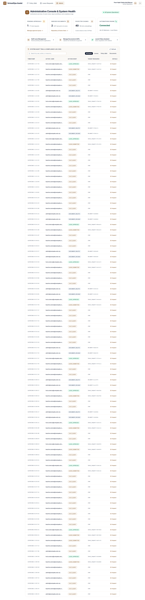

# 🏫 SchoolPilot — Institutional AI Operations & Workflow Automation Platform

[](https://fastapi.tiangolo.com)
[](https://reactjs.org)
[](https://github.com/pgvector/pgvector)
[](https://n8n.io)
[](https://ollama.com)
[](LICENSE)
[-brightgreen.svg)]()

> **SchoolPilot** is an institutional operations assistant and workflow automation platform designed specifically for schools, private academies, and learning centres. Built with a strict **RM0 development cost constraint**, it runs entirely on local inference and self-hosted open-source infrastructure with zero external API dependencies.

---

## 📌 Problem Solved: The "Human Router" Bottleneck

School administrators and operations staff spend dozens of hours every week acting as manual human routers:
1. **Repetitive Policy Questions**: Fielding the same questions regarding leave entitlements, examination invigilation, emergency duty rules, and medical certificate (MC) protocols scattered across PDFs and handbook circulars.
2. **Friction in Administrative Actions**: Teachers find policies, but must switch tools or fill paper forms to submit leave, nominate relief teachers, and notify department heads.
3. **Approval Delays & Opaque Trails**: Leave requests get lost in chat groups or email inboxes without clear approver routing or immutable compliance records.
4. **Subscription & Privacy Barriers**: Commercial cloud AI tools cost thousands annually in per-seat subscriptions and pose data privacy risks with sensitive employee records.

**SchoolPilot solves this** by pairing **local RAG with verifiable citations** and **conversational guided action forms** routed directly into **visual n8n approval pipelines** — 100% on-premises with zero token costs.

---

## 🏛️ System Architecture

SchoolPilot uses a decoupled, production-grade microservice architecture orchestrated via Docker Compose:



---

## 🛠️ Technology Stack (Strict RM0 Cost)

| Layer | Technology | Key Capabilities |
|---|---|---|
| **Frontend** | React 18 + Vite + TypeScript + Tailwind CSS | Role-based navigation, accessible modals, responsive mobile drawers, real-time citation cards |
| **Backend API** | FastAPI (Python 3.12) + Pydantic v2 + SQLAlchemy 2.0 | Async request handling, Pydantic validation, RBAC route security, PyMuPDF / python-docx extraction |
| **Database & Vectors** | PostgreSQL 16 + `pgvector` | HNSW cosine similarity vector indexing (`m=16, ef_construction=64`), relational integrity |
| **Workflow Engine** | n8n Community Edition (Self-Hosted) | Visual event triggers, department-based approver routing, webhook authentication |
| **Local AI Inference** | Ollama (`qwen2.5:7b` + `nomic-embed-text`) | Open-weights LLM inference with strict JSON schema enforcement and zero external data transfer |
| **Security** | PyJWT (HS256) + Passlib (bcrypt) | Stateless tokens, constant-time API key verification, granular role permissions |
| **Orchestration** | Docker Compose | Multi-container networking, healthchecks, volume persistence, one-click Windows launcher (`run.bat`) |

---

## ✨ Key Features

### 1. 📚 Policy & SOP Q&A with Verbatim Citations (RAG Core)
- Upload institutional handbooks, examination guidelines, and administrative circulars (`.pdf`, `.docx`, `.md`, `.txt`).
- Heading-aware document parsing with context enrichment (chunk index, page number, section title).
- Semantic search powered by `nomic-embed-text` (768-dim) and `pgvector` HNSW cosine indexing.
- Responses contain **verbatim citations** with clickable source expanders showing the exact excerpt, page, and document.

### 2. ⚡ Guided Actions: Leave Intent Detection & Form Auto-Population
- Detects actionable administrative intent from natural conversational input (e.g. *"I have a high fever and need emergency leave tomorrow, Mr. Lee will cover"*).
- Automatically extracts structured parameters: `leave_type`, `start_date`, `end_date`, `reason`, and `covering_teacher`.
- Renders an interactive, pre-filled submission form directly within the chat stream.

### 3. 🔀 Hybrid n8n Workflow Automation & Resilient Fallback
- **Primary Route**: Requests trigger visual n8n event workflows for approver assignment based on teacher department (e.g. Science & Math vs. Humanities).
- **Fail-Safe Fallback**: If n8n times out or is offline, FastAPI automatically executes internal direct RAG retrieval with zero user downtime.

### 4. 👥 Role-Based Access Control (RBAC)
- **Teacher**: Ask policy questions, submit leave requests with relief teacher nomination, monitor personal request history.
- **Head of Department (HoD)**: Review departmental leave queue, approve/reject applications with remarks, monitor staff availability.
- **School Administrator**: Central operational dashboard, document ingestion management, real-time integration health probes, immutable audit trail.

### 5. 🛡️ Immutable Audit Trail & Live Integration Health
- Append-only audit logger tracking document ingestion, leave submissions, approvals, rejections, and chat queries with actor metadata and JSON diffs.
- Live server-side health checks for PostgreSQL, pgvector indices, Ollama model availability, and n8n webhook latency.

---

## 📸 Screenshots Showcase

### 1. Interactive Policy Assistant with Verbatim Citations
| RAG Grounded Answer & Confidence Badge | Expandable Source Quotations & Citations |
|:---:|:---:|
|  |  |

### 2. Guided Action: Leave Intent Detection & Pre-filled Form
| Natural Language Leave Extraction Form | Real-Time Submission Confirmation |
|:---:|:---:|
|  |  |

### 3. Departmental Approvals & Administrative Console
| HoD Departmental Review & Action Queue | Admin Console Metrics & System Health |
|:---:|:---:|
|  |  |

### 4. Document Repository & Immutable Audit Trail
| Document Management & Vector Ingestion | Searchable Audit Trail with JSON Payload Inspector |
|:---:|:---:|
|  |  |

### 5. Cross-Platform Mobile & Responsive Views
| Mobile Welcome & Category Prompts | Responsive Staff Leave List |
|:---:|:---:|
|  |  |

---

## 🔒 Security & Role Permissions Matrix

| Capability | Teacher (`teacher`) | Head of Department (`hod`) | Administrator (`admin`) |
|---|:---:|:---:|:---:|
| **Ask Policy Questions (RAG)** | ✅ | ✅ | ✅ |
| **Submit Leave Request** | ✅ | ✅ | ✅ |
| **View Personal Leave History** | ✅ | ✅ | ✅ |
| **Approve/Reject Department Leaves** | ❌ | ✅ *(Same Department)* | ✅ *(All Departments)* |
| **Upload / Delete Policy Documents** | ❌ | ❌ | ✅ |
| **View System Health & Status** | ❌ | ❌ | ✅ |
| **Inspect Immutable Audit Logs** | ❌ | ❌ | ✅ |

---

## 🚀 Quick Start Guide

### Prerequisites
- [Docker Desktop](https://www.docker.com/) (with WSL 2 enabled on Windows).
- [Ollama](https://ollama.com/) running natively on your host machine.

### Step 1: Pull Local Open-Weights Models
```bash
# Pull local embedding model (~274 MB)
ollama pull nomic-embed-text

# Pull local instruction-tuned LLM (~4.7 GB)
ollama pull qwen2.5:7b
```

### Step 2: Configure Environment
```bash
# Copy example configuration
cp .env.example .env
```

### Step 3: Launch Containers

**Option A — Windows One-Click Launcher**:
Double-click `run.bat` or execute in PowerShell:
```cmd
run.bat
```

**Option B — Standard Docker Compose**:
```bash
docker compose up -d --build
```

### Step 4: Access Application Endpoints
- **Staff & Admin Web Portal**: [http://localhost:5173](http://localhost:5173)
- **FastAPI Interactive API Docs**: [http://localhost:8000/docs](http://localhost:8000/docs) (or [http://localhost:8005/docs](http://localhost:8005/docs) when mapped)
- **n8n Automation Engine**: [http://localhost:5678](http://localhost:5678)

---

## 👥 Demo Personas (Pre-Seeded)

All demo accounts share the password: `Password123!`

| Role | Name | Email | Department | Description |
|---|---|---|---|---|
| **Admin** | Puan Hajah Zaleha | `admin@cempaka.edu.my` | School Operations | Full oversight, document ingestion, health monitor, audit inspection |
| **HoD** | Dr. Ramesh Krishnan | `hod.science@cempaka.edu.my` | Science & Mathematics | Reviews and approves Science department leave applications |
| **HoD** | Mrs. Catherine Wong | `hod.humanities@cempaka.edu.my` | Humanities & Languages | Reviews Humanities department applications |
| **Teacher** | Cikgu Azman | `teacher.azman@cempaka.edu.my` | Science & Mathematics | Queries handbook policies, submits emergency medical leaves |
| **Teacher** | Mr. Lee Wei Hong | `teacher.lee@cempaka.edu.my` | Science & Mathematics | Nominated relief teacher for science classes |
| **Teacher** | Ms. Priya Nair | `teacher.priya@cempaka.edu.my` | Humanities & Languages | English and literature instructional staff |

*(The login screen includes a 1-click **Quick Switch** for instant persona demonstration).*

---

## 🧪 Ingesting Sample Institutional Documents

To seed the synthetic Sri Cempaka Staff Operational Handbook and Leave SOP into pgvector:
```bash
docker exec schoolpilot_backend python seed_data.py
```
Or upload any `.pdf`, `.docx`, or `.md` file directly via the **Documents** tab in the admin portal.

---

## 🧪 Testing & Verification

Run the automated test suite across backend unit tests, RBAC security gates, and integration suites:

```bash
# Run backend pytest suite
$env:PYTHONPATH="backend"; pytest backend/tests -v

# Run frontend build & type check
cd frontend && npm run build

# Run live E2E verification
python backend/scripts/verify_live_e2e.py
```

See [docs/testing.md](docs/testing.md) for full details on testing fixtures, coverage, and Playwright accessibility audits.

---

## 📖 Architectural Decision Records (ADRs)

Key architectural decisions are documented in `docs/decisions/`:
- [ADR-001: Hybrid Orchestration (n8n Webhooks with FastAPI Fallback)](docs/decisions/ADR-001-hybrid-n8n-orchestration.md)
- [ADR-002: Local Self-Hosted AI Infrastructure (Ollama + pgvector HNSW)](docs/decisions/ADR-002-self-hosted-local-ai.md)
- [ADR-003: Role-Based Access Control and Immutable Audit Logging](docs/decisions/ADR-003-rbac-and-audit-trail.md)

See [docs/architecture.md](docs/architecture.md) for the in-depth system architecture specification.

---

## ⚠️ Known Limitations & Future Roadmap

- **Single-Node Deployment**: Currently configured for single-host institutional deployment; future work will include multi-replica backend scaling and distributed Redis caching.
- **OCR Ingestion**: Scanned image PDFs rely on Tesseract OCR; future enhancements will add layout-aware vision models for complex tables.
- **WhatsApp / Telegram Bot Connector**: Direct webhook connectors to n8n for emergency broadcast notifications to staff mobile channels.

---

## 📄 License

This project is licensed under the MIT License — see the [LICENSE](LICENSE) file for details.
