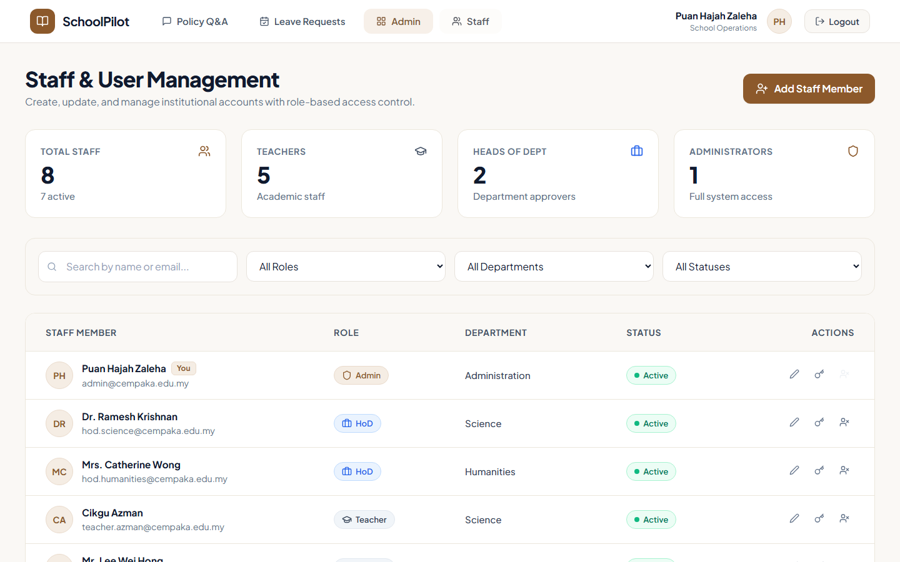
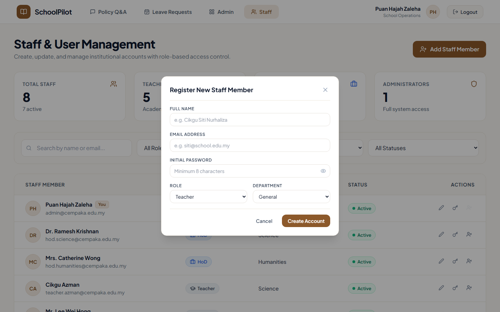
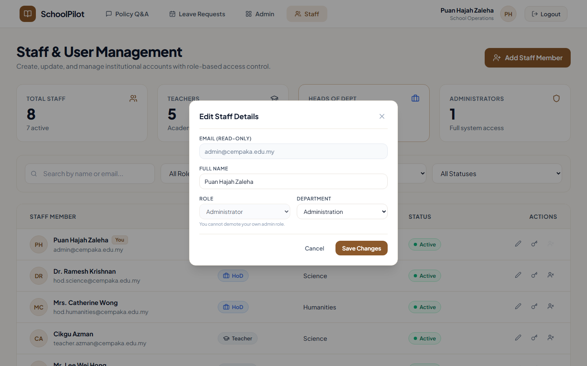
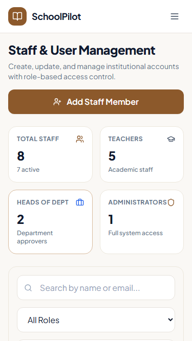
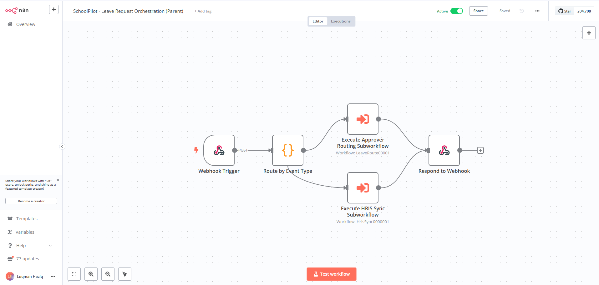
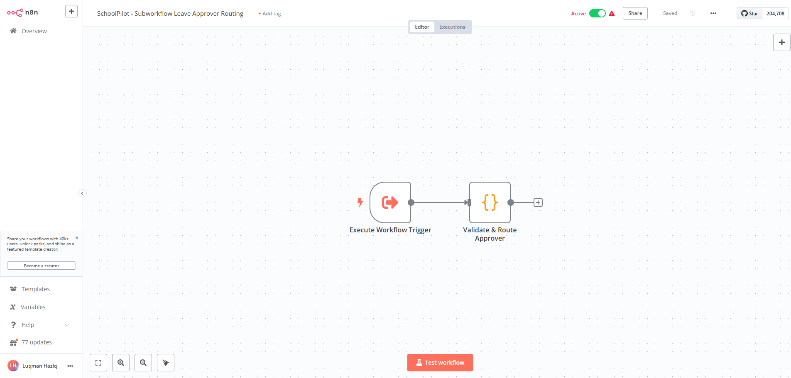
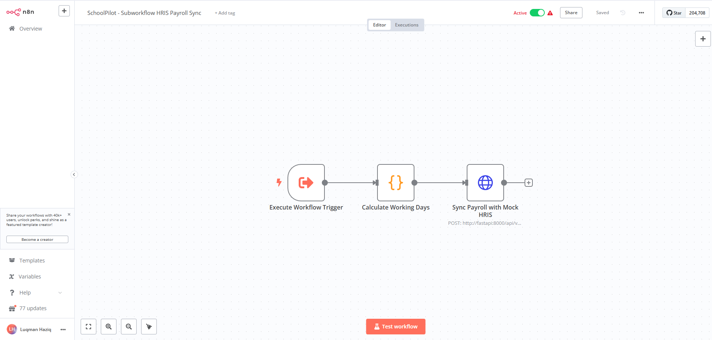
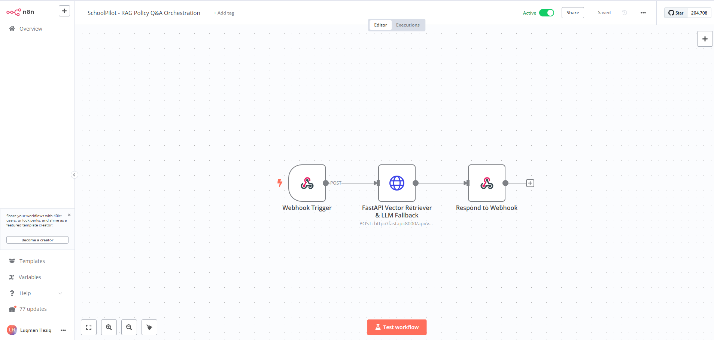
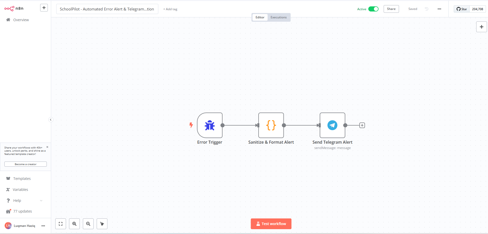
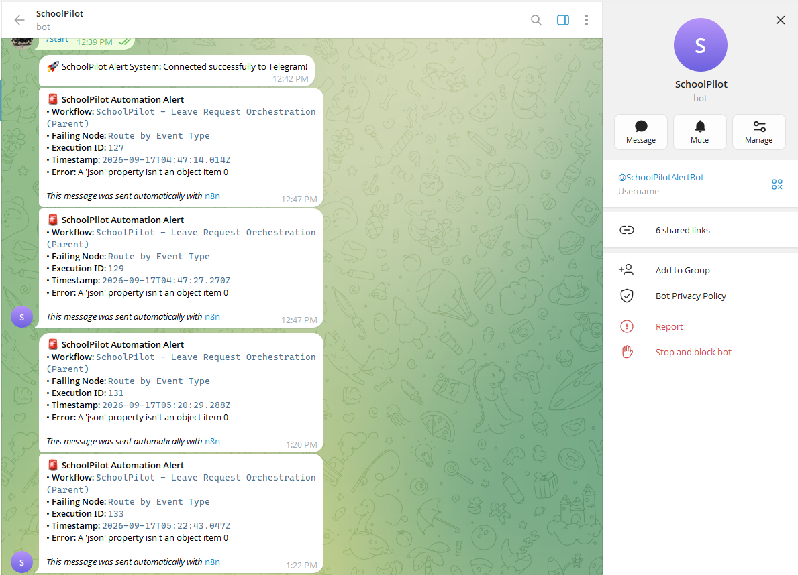

# 🏫 SchoolPilot — Institutional AI Operations & Workflow Automation Platform

[](https://fastapi.tiangolo.com)
[](https://reactjs.org)
[](https://github.com/pgvector/pgvector)
[](https://n8n.io)
[](https://ollama.com)
[](LICENSE)
[-brightgreen.svg)]()

> **SchoolPilot** is an institutional operations assistant and workflow automation platform designed specifically for schools, private academies, and learning centres. Built with a strict **RM0 development cost constraint**, it runs entirely on local inference and self-hosted open-source infrastructure with zero external API dependencies.

---

## 📌 Problem Solved: The "Human Router" Bottleneck

School administrators and operations staff spend dozens of hours every week acting as manual human routers:
1. **Repetitive Policy Questions**: Fielding the same questions regarding leave entitlements, examination invigilation, emergency duty rules, and medical certificate (MC) protocols scattered across PDFs and handbook circulars.
2. **Friction in Administrative Actions**: Teachers find policies, but must switch tools or fill paper forms to submit leave, nominate relief teachers, and notify department heads.
3. **Approval Delays & Opaque Trails**: Leave requests get lost in chat groups or email inboxes without clear approver routing or immutable compliance records.
4. **Subscription & Privacy Barriers**: Commercial cloud AI tools cost thousands annually in per-seat subscriptions and pose data privacy risks with sensitive employee records.

**SchoolPilot solves this** by pairing **local RAG with verifiable citations** and **conversational guided action forms** routed directly into **visual n8n approval pipelines** — 100% on-premises with zero token costs.

---

## 📈 Outcomes

- Architected an RM0 self-hosted school operations platform pairing local RAG (Ollama qwen2.5:7b, 768-dim nomic-embed-text, pgvector HNSW) with verbatim page-level citations for staff policy questions.
- Routed teacher leave requests to department heads through an n8n parent orchestrator and 2 sub-workflows (approver routing, HRIS payroll sync), with a FastAPI fallback that kept policy answers available when n8n went offline.
- Converted natural-language leave requests into pre-filled forms by extracting 5 fields (leave type, start date, end date, reason, covering teacher) directly in the chat stream.
- Secured 3 staff roles (teacher, HoD, admin) with JWT and bcrypt, logged every approval to an append-only audit trail, and verified behavior with 83+ pytest tests across 14 modules.
- Redacted personal and medical data from n8n failure alerts before sending them to Telegram, backed by live health probes (PostgreSQL 3 ms, Ollama 12 ms, n8n webhook 18 ms) and 6 architecture decision records.

---

## 🏛️ System Architecture

### High-Level Operations Architecture

The system uses a decoupled, privacy-preserving microservice architecture with 5 core layers — all self-hosted and orchestrated via Docker Compose:


*▲ End-to-end architecture: React 18 Frontend (Role-Based Guards) → FastAPI API Gateway (JWT Auth, Chunker, pgvector Retriever) → n8n Workflow Automation Engine → Ollama Local AI (nomic-embed-text + Qwen 2.5) → PostgreSQL 16 + pgvector (Relational integrity & 768-dim HNSW vector store).*

---

### Automated Error Resilience & Telegram Alerting

Global error handling architecture capturing failures, redacting PII, and dispatching instant Telegram notifications:


*▲ Error Alert Pipeline: Any node failure in n8n triggers the centralized error handler, scrubs sensitive personal/medical data, and dispatches a formatted markdown alert via Telegram.*

---

## 🔄 How It Works

### AI Knowledge Pipeline — From Documents to Grounded Citations

This diagram shows the complete end-to-end RAG (Retrieval-Augmented Generation) pipeline: how school policy documents are ingested, chunked, embedded, stored, retrieved, and served back as grounded answers with citations:


*▲ RAG Pipeline: Documents are uploaded, chunked with heading metadata, embedded locally via Ollama (nomic-embed-text), stored in pgvector, and retrieved via cosine similarity to generate cited answers through the FastAPI backend.*

---

### Modular HR Leave Approval & HRIS Sync Workflow

The leave lifecycle is automated through parent-child modular sub-workflows:


*▲ Leave Automation: Natural language chat submission → AI validation with repair gate → parent orchestrator dispatch → department-based approver routing & mock HRIS payroll sync → HoD review → immutable audit trail.*

---

## 🛠️ Technology Stack (Strict RM0 Cost)

| Layer | Technology | Key Capabilities |
|---|---|---|
| **Frontend** | React 18 + Vite + TypeScript + Tailwind CSS | Role-based navigation, accessible modals, responsive mobile drawers, real-time citation cards |
| **Backend API** | FastAPI (Python 3.12) + Pydantic v2 + SQLAlchemy 2.0 | Async request handling, Pydantic validation, RBAC route security, PyMuPDF / python-docx extraction |
| **Database & Vectors** | PostgreSQL 16 + `pgvector` | HNSW cosine similarity vector indexing (`m=16, ef_construction=64`), relational integrity |
| **Workflow Engine** | n8n Community Edition (Self-Hosted) | Visual event triggers, department-based approver routing, webhook authentication |
| **Local AI Inference** | Ollama (`qwen2.5:7b` + `nomic-embed-text`) | Open-weights LLM inference with strict JSON schema enforcement and zero external data transfer |
| **Security** | PyJWT (HS256) + Passlib (bcrypt) | Stateless tokens, constant-time API key verification, granular role permissions |
| **Orchestration** | Docker Compose | Multi-container networking, healthchecks, volume persistence, one-click Windows launcher (`run.bat`) |

---

## ✨ Key Features

### 1. 📚 Policy & SOP Q&A with Verbatim Citations (RAG Core)
- Upload institutional handbooks, examination guidelines, and administrative circulars (`.pdf`, `.docx`, `.md`, `.txt`).
- Heading-aware document parsing with context enrichment (chunk index, page number, section title).
- Semantic search powered by `nomic-embed-text` (768-dim) and `pgvector` HNSW cosine indexing.
- Responses contain **verbatim citations** with clickable source expanders showing the exact excerpt, page, and document.

### 2. ⚡ Guided Actions: Leave Intent Detection & Form Auto-Population
- Detects actionable administrative intent from natural conversational input (e.g. *"I have a high fever and need emergency leave tomorrow, Mr. Lee will cover"*).
- Automatically extracts structured parameters: `leave_type`, `start_date`, `end_date`, `reason`, and `covering_teacher`.
- Renders an interactive, pre-filled submission form directly within the chat stream.

### 3. 🔀 Hybrid n8n Workflow Automation & Resilient Fallback
- **Primary Route**: Requests trigger visual n8n event workflows for approver assignment based on teacher department (e.g. Science & Math vs. Humanities).
- **Fail-Safe Fallback**: If n8n times out or is offline, FastAPI automatically executes internal direct RAG retrieval with zero user downtime.

### 4. 👥 Role-Based Access Control (RBAC)
- **Teacher**: Ask policy questions, submit leave requests with relief teacher nomination, monitor personal request history.
- **Head of Department (HoD)**: Review departmental leave queue, approve/reject applications with remarks, monitor staff availability.
- **School Administrator**: Central operational dashboard, document ingestion management, real-time integration health probes, immutable audit trail.

### 5. 🛡️ Immutable Audit Trail & Live Integration Health
- Append-only audit logger tracking document ingestion, leave submissions, approvals, rejections, and chat queries with actor metadata and JSON diffs.
- Live server-side health checks for PostgreSQL, pgvector indices, Ollama model availability, and n8n webhook latency.

---

## 📸 Screenshots & User Guide

### 🔐 Login & Authentication

The login screen includes **Quick Switch** buttons for instant demo persona switching between Admin, HoD, and Teacher roles.


*▲ Desktop login page with institutional branding, password visibility toggle, and one-click Quick Switch demo accounts.*

#### Login Error Handling

Clear inline validation feedback when credentials are incorrect — no ambiguous error states:


*▲ Error state: "Invalid email or password" banner shown with clear visual feedback and intact Quick Switch buttons for recovery.*

---

### 💬 Policy Assistant — AI-Powered Chat Interface

#### Welcome Screen & Category Quick Start

Staff are greeted with guided category cards (School Policies, Leave & Attendance, HR & Administration, Find a Regulation) and example prompts:


*▲ Desktop chat welcome screen with categorized quick-start cards and conversational example prompts to guide first-time users.*

#### RAG Grounded Response with Confidence & Citations

Answers include a confidence badge and verbatim source citations. Click to expand the exact excerpt, document name, and page number:

| RAG Grounded Answer & Confidence Badge | Expandable Source Quotations & Citations |
|:---:|:---:|
|  |  |
| *AI-generated answer with confidence level and source attribution* | *Expanded citation card with exact excerpt, document name, and page number* |

#### n8n Workflow-Orchestrated Response

When n8n is active, queries are routed through the visual automation engine for enhanced orchestration:


*▲ Response orchestrated through n8n webhook: the query is sent to the automation engine, which calls FastAPI's vector retriever and returns a grounded answer with citations.*

---

### ⚡ Guided Leave Application — From Chat to Submission

Teachers can request leave in natural language. The AI extracts leave details and auto-populates a structured form inline:

| Natural Language Leave Extraction Form | Real-Time Submission Confirmation |
|:---:|:---:|
|  |  |
| *AI parses "I need emergency leave tomorrow, Mr. Lee will cover" into structured form fields* | *Instant submission confirmation with request ID and pending status badge* |

---

### 📋 Leave Management — Role-Based Views

#### Teacher View: Personal Leave Tabs

Teachers can filter their personal leave history by status — Pending and Approved tabs:

| Pending Leave Requests | Approved Leave Requests |
|:---:|:---:|
|  |  |
| *Teacher's pending leave queue awaiting department head review* | *Approved requests with approver name and decision timestamp* |

#### Leave Detail Cards

Detailed view of individual leave requests showing full metadata, status, and approval chain:

| Pending Leave Detail | Approved Leave Detail |
|:---:|:---:|
|  |  |
| *Full pending request detail with covering teacher and submission timestamp* | *Approved request showing HoD remarks and approval timestamp* |

#### HoD View: Departmental Approval Queue

Head of Department reviews pending requests from their department with approve/reject actions and remarks:

| HoD Departmental Review Queue | Rejection Modal with Remarks |
|:---:|:---:|
|  |  |
| *HoD sees only their department's pending requests with quick approve/reject* | *Rejection requires mandatory remarks — all decisions are audit-logged* |

---

### 🛠️ Admin Console — Operations Dashboard

#### Administrative Overview & System Health

The admin dashboard provides a unified command centre with key metrics, 4 quick-access shortcut cards, and the system audit trail:


*▲ Full admin dashboard: KPI cards (pending approvals, indexed documents, pgvector chunks, n8n engine status), 4 quick-action shortcuts (including Staff Management), and the searchable audit trail with category filters.*

#### Live Integration Status Monitor

Real-time health checks for all system services — accessible from the admin dashboard via "View integration status":


*▲ Integration health modal: all four services showing UP with response latency, version info, model details, and n8n webhook endpoint URLs.*

---

### 👥 Staff & User Account Management (`/admin/users`)

Admins manage user accounts, assign roles (`admin`, `hod`, `teacher`), departments, and toggle active status with full table pagination:

| Staff Directory & Role Management | Add Staff Account Modal |
|:---:|:---:|
|  |  |
| *Staff directory: search, role filter, department filter, and interactive pagination controls* | *Register staff modal: accessible form with immediate role-based provisioning* |

| Edit Staff Details Modal | Mobile Staff Management View |
|:---:|:---:|
|  |  |
| *Edit staff modal: secure role and department updates with audit trail logging* | *Mobile responsive layout: stacked staff cards optimized for compact screens* |

---

### 📄 Document Management & Audit Trail

#### Document Repository & Vector Ingestion

Admins manage the institutional knowledge base — uploaded documents are chunked and embedded into pgvector:

| Document Repository & Vector Status | Upload Success Confirmation |
|:---:|:---:|
|  |  |
| *Repository listing with chunk counts and vector embedding status per document* | *Upload confirmation: document parsed, chunked, and embedded into pgvector* |

#### Immutable Audit Trail & JSON Inspector

Every system action is logged with actor metadata, timestamps, and JSON diffs — fully searchable:

| Searchable Audit Trail | Audit Log JSON Inspector |
|:---:|:---:|
|  |  |
| *Filterable audit trail with Leave, Policy Q&A, and Documents category tabs* | *JSON inspector modal: full event payload, actor metadata, and state diffs* |

---

### 🔧 n8n Modular Workflows & Telegram Alerting

The n8n self-hosted workflow engine handles modular leave orchestration, department routing, HRIS sync, RAG execution, and automated error notifications:

#### Parent Orchestrator & Sub-Workflows

| Leave Approval Parent Orchestrator | Leave Approver Routing Sub-Workflow |
|:---:|:---:|
|  |  |
| *Parent workflow: validates payload and executes modular sub-workflows* | *Child sub-workflow: classifies department and routes to HoD* |

| HRIS Payroll Sync Sub-Workflow | Policy RAG Chat Orchestration |
|:---:|:---:|
|  |  |
| *Child sub-workflow: computes working days & updates payroll sync table* | *RAG workflow: webhook vector retrieval pipeline with grounded citations* |

#### Automated Telegram Error Alerting

| n8n Error Trigger & PII Redactor | Live Telegram Bot Notification |
|:---:|:---:|
|  |  |
| *Global error handler: catches failed nodes, scrubs personal data, and dispatches alert* | *Live Telegram alert: immediate operational notification with zero privacy leakage* |

---

### 📱 Cross-Platform Mobile & Responsive Views

SchoolPilot is fully responsive across desktop, tablet, and mobile breakpoints:

#### Mobile Views — Chat, Leave, Navigation

| Mobile Chat Welcome | Mobile Leave List | Mobile Navigation Drawer |
|:---:|:---:|:---:|
|  |  |  |
| *Chat welcome with stacked category cards on mobile* | *Leave history with compact status cards* | *Slide-out nav drawer with role-aware menu items* |

#### Mobile & Tablet — Login Across Breakpoints

| Tablet Landscape (1024×768) | Tablet Portrait (768×1024) | Mobile (375×667) |
|:---:|:---:|:---:|
|  |  |  |
| *Landscape tablet: side-by-side layout with background art* | *Portrait tablet: centered card with visible branding* | *Mobile: full-width compact login with stacked controls* |

#### Mobile & Tablet — Admin Dashboard Across Breakpoints

| Admin Dashboard — Tablet Landscape (1024×768) | Admin Dashboard — Mobile (375×667) |
|:---:|:---:|
|  |  |
| *Tablet: full dashboard with grid layout and audit trail visible* | *Mobile: stacked cards with scrollable compact layout* |

---

## 🔒 Security & Role Permissions Matrix

| Capability | Teacher (`teacher`) | Head of Department (`hod`) | Administrator (`admin`) |
|---|:---:|:---:|:---:|
| **Ask Policy Questions (RAG)** | ✅ | ✅ | ✅ |
| **Submit Leave Request** | ✅ | ✅ | ✅ |
| **View Personal Leave History** | ✅ | ✅ | ✅ |
| **Approve/Reject Department Leaves** | ❌ | ✅ *(Same Department)* | ✅ *(All Departments)* |
| **Upload / Delete Policy Documents** | ❌ | ❌ | ✅ |
| **View System Health & Status** | ❌ | ❌ | ✅ |
| **Inspect Immutable Audit Logs** | ❌ | ❌ | ✅ |

---

## 🚀 Quick Start Guide

### Prerequisites
- [Docker Desktop](https://www.docker.com/) (with WSL 2 enabled on Windows).
- [Ollama](https://ollama.com/) running natively on your host machine.

### Step 1: Pull Local Open-Weights Models
```bash
# Pull local embedding model (~274 MB)
ollama pull nomic-embed-text

# Pull local instruction-tuned LLM (~4.7 GB)
ollama pull qwen2.5:7b
```

### Step 2: Configure Environment
```bash
# Copy example configuration
cp .env.example .env
```

### Step 3: Launch Containers

**Option A — Windows One-Click Launcher**:
Double-click `run.bat` or execute in PowerShell:
```cmd
run.bat
```

**Option B — Standard Docker Compose**:
```bash
docker compose up -d --build
```

### Step 4: Access Application Endpoints
- **Staff & Admin Web Portal**: [http://localhost:5173](http://localhost:5173)
- **FastAPI Interactive API Docs**: [http://localhost:8000/docs](http://localhost:8000/docs) (or [http://localhost:8005/docs](http://localhost:8005/docs) when mapped)
- **n8n Automation Engine**: [http://localhost:5678](http://localhost:5678)

---

## 👥 Demo Personas (Pre-Seeded)

All demo accounts share the password: `Password123!`

| Role | Name | Email | Department | Description |
|---|---|---|---|---|
| **Admin** | Puan Hajah Zaleha | `admin@cempaka.edu.my` | School Operations | Full oversight, document ingestion, health monitor, audit inspection |
| **HoD** | Dr. Ramesh Krishnan | `hod.science@cempaka.edu.my` | Science & Mathematics | Reviews and approves Science department leave applications |
| **HoD** | Mrs. Catherine Wong | `hod.humanities@cempaka.edu.my` | Humanities & Languages | Reviews Humanities department applications |
| **Teacher** | Cikgu Azman | `teacher.azman@cempaka.edu.my` | Science & Mathematics | Queries handbook policies, submits emergency medical leaves |
| **Teacher** | Mr. Lee Wei Hong | `teacher.lee@cempaka.edu.my` | Science & Mathematics | Nominated relief teacher for science classes |
| **Teacher** | Ms. Priya Nair | `teacher.priya@cempaka.edu.my` | Humanities & Languages | English and literature instructional staff |

*(The login screen includes a 1-click **Quick Switch** for instant persona demonstration).*

---

## 🧪 Ingesting Sample Institutional Documents

To seed the synthetic Sri Cempaka Staff Operational Handbook and Leave SOP into pgvector:
```bash
docker exec schoolpilot_backend python seed_data.py
```
Or upload any `.pdf`, `.docx`, or `.md` file directly via the **Documents** tab in the admin portal.

---

## 🧪 Testing & Verification

Run the automated test suite across backend unit tests, Alembic migration verification, workflow guardrail validation, and frontend builds:

```bash
# Validate n8n workflow JSON structure and security guardrails
python backend/scripts/validate_workflows.py

# Run backend pytest suite (83+ tests across 14 modules)
$env:PYTHONPATH="backend"; pytest backend/tests -v

# Run frontend build & type check
cd frontend && npm run build

# Run live E2E verification
python backend/scripts/verify_live_e2e.py
```

See [docs/testing.md](docs/testing.md) for full details on testing fixtures, coverage, and Playwright accessibility audits.

---

## 📖 Architectural Decision Records (ADRs)

Key architectural decisions are documented in `docs/decisions/`:
- [ADR-001: Hybrid Orchestration (n8n Webhooks with FastAPI Fallback)](docs/decisions/ADR-001-hybrid-n8n-orchestration.md)
- [ADR-002: Local Self-Hosted AI Infrastructure (Ollama + pgvector HNSW)](docs/decisions/ADR-002-self-hosted-local-ai.md)
- [ADR-003: Role-Based Access Control and Immutable Audit Logging](docs/decisions/ADR-003-rbac-and-audit-trail.md)
- [ADR-004: Resilience, Sub-Workflows, and Error Alerting](docs/decisions/ADR-004-resilience-subworkflows-and-error-alerts.md)
- [ADR-005: Mock HRIS Payroll API, Entitlements, and Idempotency](docs/decisions/ADR-005-mock-hris-payroll-and-idempotency.md)
- [ADR-006: Database Migrations with Alembic and Automated CI Quality Gates](docs/decisions/ADR-006-alembic-migrations-and-ci-gates.md)

See [docs/architecture.md](docs/architecture.md) for the in-depth system architecture specification.

---

## ⚠️ Known Limitations & Future Roadmap

- **Single-Node Deployment**: Currently configured for single-host institutional deployment; future work will include multi-replica backend scaling and distributed Redis caching.
- **OCR Ingestion**: Scanned image PDFs rely on Tesseract OCR; future enhancements will add layout-aware vision models for complex tables.
- **WhatsApp / Telegram Bot Connector**: Direct webhook connectors to n8n for emergency broadcast notifications to staff mobile channels.

---

## 📄 License

This project is licensed under the MIT License — see the [LICENSE](LICENSE) file for details.
